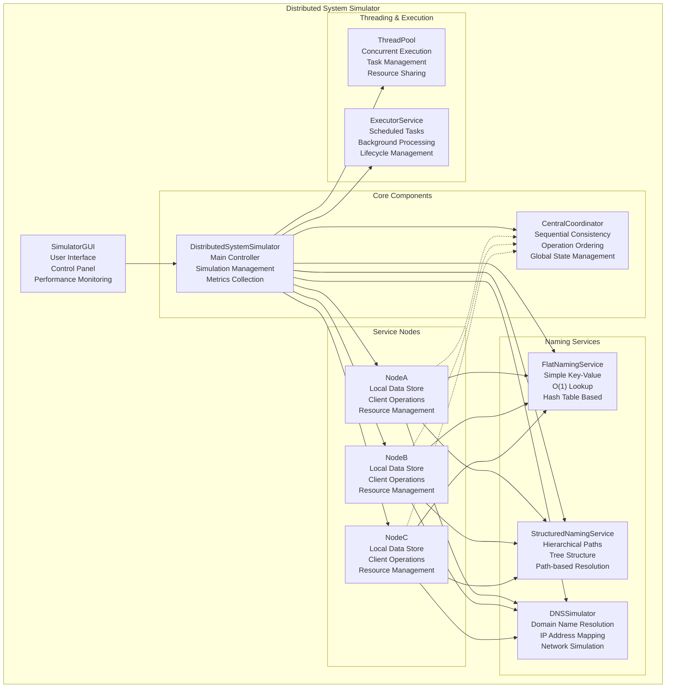
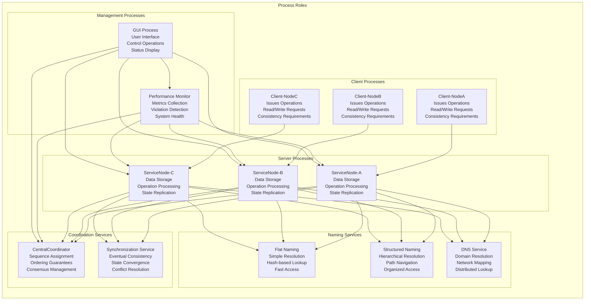
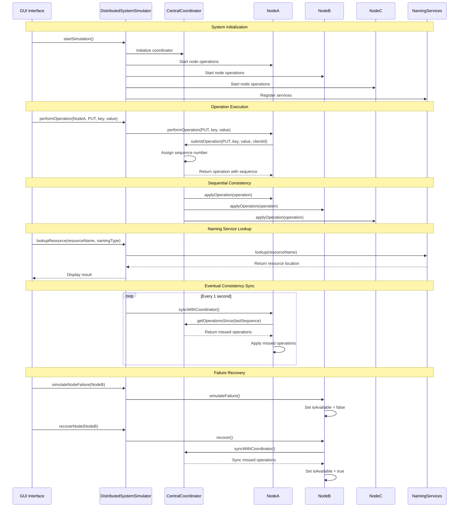
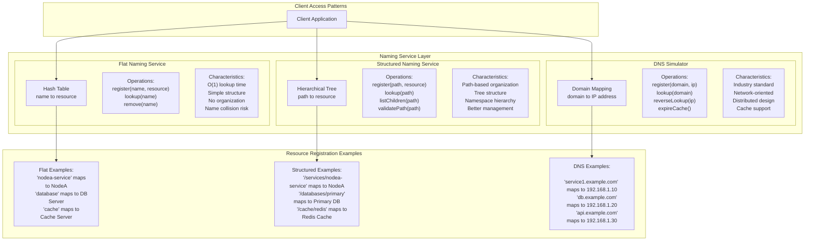
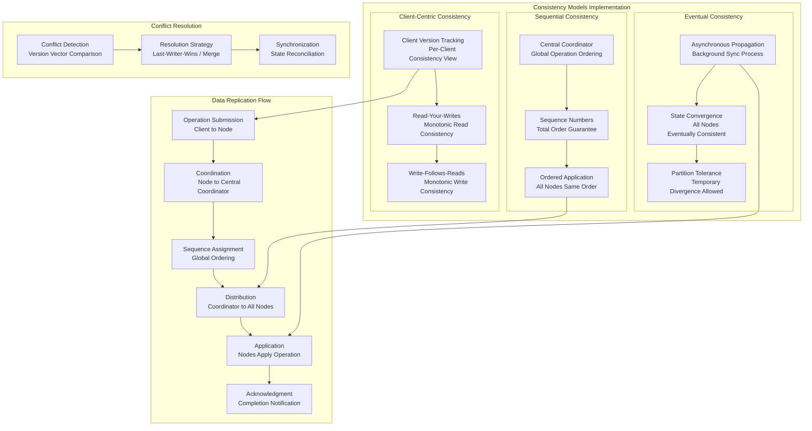
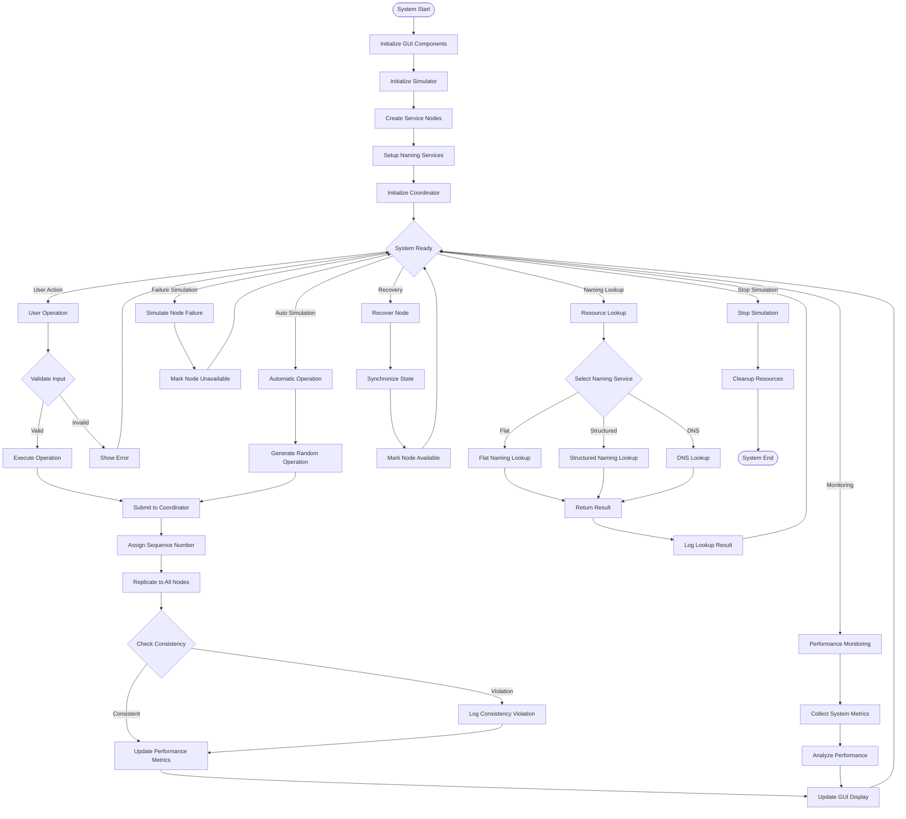

# Distributed System Simulator - Architecture and Design Analysis

## System Overview
The Distributed System Simulator is a comprehensive platform that demonstrates distributed computing concepts including consistency models, naming services, threading, fault tolerance, and performance monitoring. The system combines multiple distributed system paradigms in a unified simulation environment.

## 1. System Architecture Diagram

## 2. Process Roles and Responsibilities

## 3. Communication Methods and Patterns

## 4. Naming Service Architecture

## 5. Data Replication and Consistency Strategy

## 6. System Interaction Flow

## Design Choices and Rationale

### Name Resolution Strategy

**1. Multiple Naming Services Approach:**
- **Flat Naming:** Chosen for simplicity and performance. O(1) lookup time makes it ideal for frequently accessed resources.
- **Structured Naming:** Implements hierarchical organization similar to file systems and DNS, providing better namespace management.
- **DNS Simulation:** Represents real-world distributed naming, demonstrating industry-standard approaches.

**Rationale:** This multi-service approach allows comparison of different naming strategies and their trade-offs in various scenarios.

### Data Replication Strategy

**1. Hybrid Consistency Model:**
- **Sequential Consistency:** Implemented through a central coordinator that assigns global sequence numbers, ensuring all nodes see operations in the same order.
- **Eventual Consistency:** Background synchronization processes allow nodes to catch up asynchronously, providing better availability.
- **Client-Centric Consistency:** Per-client version tracking ensures read-your-writes consistency for individual clients.

**2. Replication Architecture:**
- **Primary-Secondary Pattern:** Central coordinator acts as the primary for operation ordering.
- **State Machine Replication:** All nodes apply the same operations in the same order.
- **Lazy Propagation:** Operations are propagated asynchronously to improve performance.

### Key Design Benefits

1. **Fault Tolerance:** Node failure simulation and recovery mechanisms demonstrate system resilience.
2. **Performance Monitoring:** Real-time metrics collection allows analysis of consistency-performance trade-offs.
3. **Scalability Demonstration:** Threading model shows how to handle concurrent operations.
4. **Educational Value:** Multiple consistency models and naming services provide comprehensive learning opportunities.

### Trade-off Analysis

**Consistency vs. Availability:**
- Strong consistency (sequential) provides guarantees but may impact availability during partitions.
- Eventual consistency improves availability but allows temporary inconsistencies.

**Performance vs. Consistency:**
- Immediate replication ensures consistency but increases latency.
- Lazy replication reduces latency but may cause temporary divergence.

**Simplicity vs. Organization:**
- Flat naming provides fast lookups but poor organization.
- Structured naming adds overhead but improves management and navigation.

This architecture demonstrates real-world distributed system challenges and solutions, providing a comprehensive platform for understanding distributed computing concepts. 